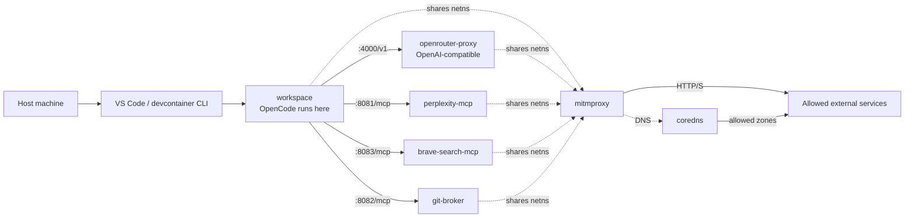
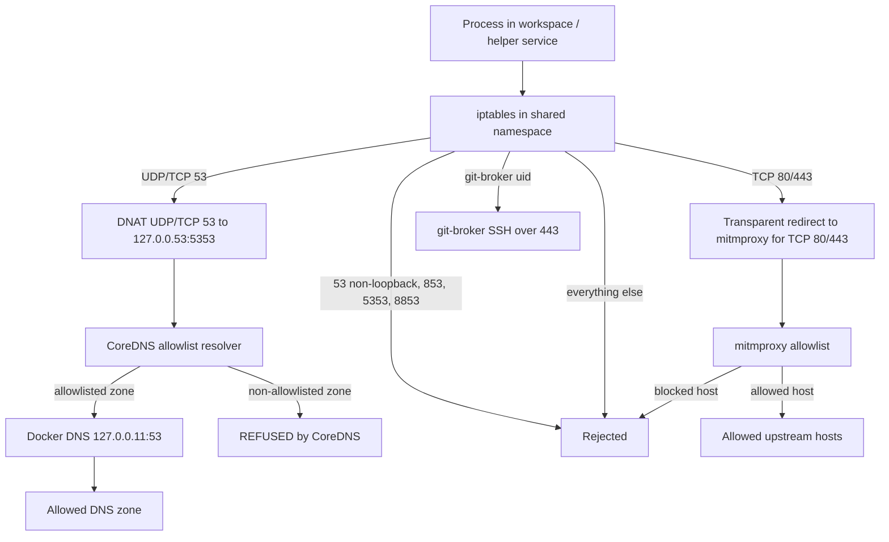
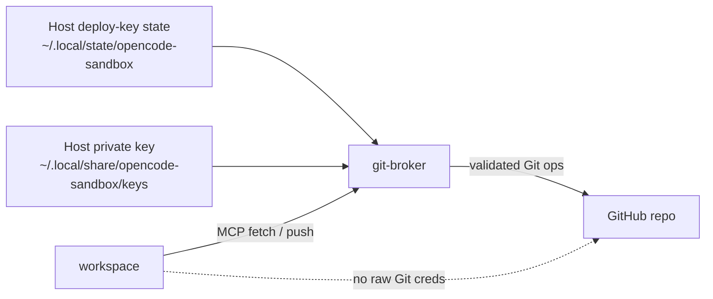

# Opencode Sandbox Devcontainer

This repository sets up a devcontainer for running OpenCode, or another agentic
CLI, inside a constrained Docker sandbox.

The goal is not perfect isolation. The goal is a practical environment with:

- a normal editor and devcontainer workflow
- a high-confidence egress boundary for the agent
- explicit MCP and model access paths
- Git access brokered separately from the main workspace
- host-managed credentials that do not live in the workspace itself

In short: the agent should be able to work, but it should not be able to talk
to arbitrary external services or receive broad Git credentials by default.

## What This Project Tries To Achieve

This setup is meant for experimenting with agentic coding tools without giving
them a normal unrestricted developer environment.

The intended security properties are:

- the agent runs in a devcontainer, not directly on the host
- most outbound traffic is forced through a shared `mitmproxy` boundary
- outbound destinations are limited by a build-time allowlist
- Git fetch/push is handled by a separate `git-broker` MCP service
- the workspace does not receive raw Git push credentials
- host secrets should stay outside the repository

Threat model focus for this sandbox:

- an adversarial model may try to exfiltrate data through non-HTTP channels
- DNS is a high-risk covert channel because small queries are easy to generate
- HTTP allowlists alone do not constrain DNS resolver behavior
- the boundary should be default-deny for both HTTP and DNS

Important limit:

- this is a containment-oriented developer sandbox, not a hardened VM boundary
- if you intentionally grant broad privileges, the boundary weakens accordingly

## Architecture

The main runtime components are:

- `workspace`: the Ubuntu devcontainer you open in VS Code / Dev Containers
- `openrouter-proxy`: an OpenAI-compatible proxy that injects your OpenRouter key
- `perplexity-mcp`: an HTTP MCP server backed by `@perplexity-ai/mcp-server`
- `brave-search-mcp`: an HTTP MCP server backed by the official Brave Search MCP image
- `coredns`: a DNS allowlist resolver for shared-namespace DNS traffic
- `git-broker`: a narrow MCP service for Git fetch/push using a dedicated repo deploy key
- `mitmproxy`: the only service with normal external egress
- `.opencode/opencode.jsonc`: project-level OpenCode config that points OpenCode at the local proxy and MCP services

### Service Topology



### Network Boundary

The `ai_boundary` Docker network is marked `internal: true`. The `workspace`,
`openrouter-proxy`, `perplexity-mcp`, `brave-search-mcp`, `coredns`, and `git-broker` services all use
`network_mode: "service:mitmproxy"`, so they share the `mitmproxy` network
namespace instead of getting their own independent egress path.

Inside that shared namespace:

- loopback traffic between the local services is allowed
- UDP/TCP port 53 is transparently redirected to CoreDNS on `127.0.0.53:5353` (`127.0.0.53` is a conventional local resolver address and avoids conflicts with Docker DNS on `127.0.0.11`)
- the `MITM_OUTPUT` chain is inserted at position 1 of the `OUTPUT` nat chain so it runs before Docker's own embedded-resolver DNAT rules (which redirect `127.0.0.11:53` traffic to Docker's internal resolver port); if appended instead, Docker intercepts DNS first and CoreDNS is bypassed entirely
- all non-CoreDNS port-53 traffic is redirected by NAT DNAT before it reaches Docker DNS at `127.0.0.11:53`; CoreDNS itself is exempt from that DNAT by UID, making it the only process that can reach Docker DNS directly
- TCP `80` and `443` are transparently redirected into `mitmproxy`
- UDP `80` and `443` are rejected to block QUIC / HTTP/3
- TCP/UDP `53` to non-loopback destinations is explicitly rejected
- TCP `853`, UDP `5353`, and TCP `8853` are explicitly rejected
- all IPv6 output is rejected; IPv6 is not used and the Docker networks have no IPv6 configured
- non-local outbound traffic is default-deny unless explicitly allowed
- the `git-broker` gets a narrow direct SSH-over-443 exception for GitHub

### Why DNS Controls Exist

Before CoreDNS, DNS lookups in the shared namespace could go to Docker's
embedded resolver and then to upstream DNS for arbitrary domains. That creates
an exfiltration path that bypasses the HTTP allowlist because DNS is not HTTP.

Examples of what this protects against:

- subdomain-encoded exfiltration (`chunk.attacker.tld` style queries)
- high-volume DNS tunneling attempts over UDP/TCP port 53
- encrypted-DNS bypass attempts over DoT-style ports

Design intent:

- HTTP traffic is policy-enforced by `mitmproxy` + `allowlist.py`
- DNS traffic is policy-enforced by CoreDNS generated from the same
  `infra/mitmproxy/allow-list.yaml` source of truth
- both controls are baked into images, so policy changes require rebuild/recreate

Important limits:

- this does not make the sandbox VM-grade isolation
- if a future HTTP allowlist change permits DoH resolver endpoints on 443,
  DNS-over-HTTPS can still become an application-layer exfil path
- allowlisted domains can still receive DNS queries for their own zones
- the current CoreDNS generation is zone-based rather than exact-host-based:
  an HTTP allowlist entry such as `github.com` permits DNS lookups for names
  under the `github.com` zone, and a wildcard HTTP entry such as
  `*.example.com` also permits the apex `example.com` unless policy generation
  is tightened further
- **VS Code automatic port forwarding is an exfiltration path that bypasses
  the network boundary entirely.** When a process inside the workspace opens
  a listening port, VS Code's remote extension detects it and silently
  forwards `host:PORT → container:PORT`. A process can exploit this to serve
  workspace files, environment variables, or secrets over HTTP to any client
  that can reach the host, without going through `mitmproxy` or the `ai_boundary`
  firewall at all — because the channel originates from the host side, not from
  inside the container. Set `"remote.autoForwardPorts": false` in VS Code
  settings and use an explicit `forwardPorts` allowlist in `devcontainer.json`
  to limit this surface.



### Git Credential Boundary

Git access is intentionally separated from the main workspace.

- the workspace does not get a PAT
- the workspace does not get a deploy key
- the broker reads host-managed deploy-key state
- the broker mounts the dedicated private key read-only
- the broker exposes MCP tools rather than raw credentials



### Allowed Hosts

The outbound traffic policy is baked into the `mitmproxy` image from
[allow-list.yaml](infra/mitmproxy/allow-list.yaml).

Each entry is a YAML mapping key (the host pattern) with an optional path list as the value:

```yaml
example.com:                  # null value → all paths and methods allowed

api.example.com:              # allow-list → only these path prefixes
  - /repos/
  - GET /user

sensitive.example.com:        # deny-list → all paths except these
  - !/admin
  - !DELETE /data/

"*.example.com":              # wildcard subdomain
```

- exact hostnames, wildcard subdomains (`*.example.com`), and a global `"*"` are supported
- path entries can be restricted to a specific HTTP method (`GET /path`, `PUT /path`)
- allow-list mode (positive entries) and deny-list mode (`!`-prefixed entries) cannot be mixed in one rule
- matching precedence: exact host > longest wildcard subdomain > `*`
- request paths are normalised before matching (dot segments, double slashes, and percent-encoding are resolved)
- **raw IP addresses are always blocked**, even if a global `"*"` rule is present — allowlist rules are hostname-only
- policy changes require rebuilding the `mitmproxy` image

**Why IP addresses are blocked and cannot be allowlisted:**

The allowlist matches on the HTTP `Host` header — the hostname the client declares in its request, not the IP it actually connected to. A client sending a request to an external IP address may set any `Host` header it chooses. Allowing raw IPs would mean:

1. The policy check runs on a bare IP rather than a meaningful hostname, so rules cannot express intent.
2. A client could connect to an allowlisted IP (for example, a shared CDN range) with a spoofed `Host` header, bypassing hostname-based controls.
3. CDN and cloud IPs rotate frequently — an IP that resolves to a safe host today may belong to a different service tomorrow.

The correct approach is always to allowlist by hostname and let DNS resolution happen normally.

The default allowlist includes:

- OpenRouter, Perplexity, Exa, Brave Search, Context7, and Grep App MCP endpoints
- GitHub endpoints needed for source fetches and metadata
- common package-manager hosts: npm, JSR, Deno, PyPI, Cargo, Go proxy, RubyGems, and Ubuntu/Debian mirrors (`archive.ubuntu.com`, `security.ubuntu.com`, `ports.ubuntu.com`, `deb.debian.org`)

## Bring it up

Putting real credentials in a `.env` file inside this repository is not
recommended if you want the agent sandbox to avoid seeing them. Credentials
stored in repo files weaken the boundary and are easy to handle incorrectly.

This repo includes a tracked
[.env.example](.env.example)
with empty values, and the workspace always mounts that file at the repo-root
`.env` path inside the container. That means a real host-side repo-root `.env`
is masked inside the workspace by default.

Recommended approaches:

1. Export `OPENROUTER_API_KEY`, `PERPLEXITY_API_KEY`, and `BRAVE_API_KEY` in the host shell before starting the devcontainer.
2. Or pass secrets from outside the repo with the Dev Container CLI.
3. Then open the repository in a Dev Container from VS Code, or start it with the Dev Container CLI.

Example CLI flow:

```sh
export OPENROUTER_API_KEY=...
export PERPLEXITY_API_KEY=...
export BRAVE_API_KEY=...
devcontainer up --workspace-folder .
devcontainer exec --workspace-folder . bash
```

Example with a secrets file stored outside the repo:

```sh
devcontainer up --workspace-folder . --secrets-file /absolute/path/to/devcontainer-secrets.json
```

The current Dev Container CLI on this machine does not provide a `down` subcommand. To stop the devcontainer session from VS Code, use `Dev Containers: Reopen Folder Locally`.

If you need to tear it down from the terminal, use Docker Compose directly:

```sh
docker compose down
```

Use `Dev Containers: Rebuild and Reopen in Container` from VS Code to restart it.

If you change `.devcontainer/Dockerfile`, rebuild the devcontainer so the baked
workspace image picks up those changes.

## MCP Configuration

The project-level MCP configuration lives in
[.opencode/opencode.jsonc](.opencode/opencode.jsonc).

Right now it includes:

- `perplexity`: a remote MCP served by the local `perplexity-mcp` container
- `brave_search`: a remote MCP served by the local `brave-search-mcp` container
- `git_broker`: a remote MCP served by the local `git-broker` container

### Optional Brave Search MCP

The Brave Search service uses the official Brave Search MCP server:

- GitHub: https://github.com/brave/brave-search-mcp-server
- Image: `mcp/brave-search:latest`

It is exposed to OpenCode as a normal remote MCP:

```jsonc
"brave_search": {
  "type": "remote",
  "url": "http://127.0.0.1:8083/mcp",
  "enabled": false
}
```

The container itself is started by Docker Compose, not by OpenCode.

It also requires a Brave Search API key to be present as `BRAVE_API_KEY`.

### Adding More MCP Servers

There are two patterns in this repo:

1. Remote MCP services, exposed on `127.0.0.1` inside the shared namespace

   This is the preferred pattern for this sandbox.

   Example:

```jsonc
"some_remote_server": {
  "type": "remote",
  "url": "http://127.0.0.1:8089/mcp",
  "enabled": true,
  "timeout": 15000
}
```

2. Local command-based MCP servers

   This is useful for simple utilities or one-off tools, but it runs the
   command from inside the workspace container.

   Example:

```jsonc
"some_local_server": {
  "type": "local",
  "command": ["npx", "-y", "some-mcp-package"],
  "enabled": true,
  "timeout": 15000
}
```

For Docker-backed local MCP servers, be explicit about the tradeoff:

- they require a working `docker` binary in the workspace
- they require access to a Docker daemon socket
- that substantially weakens the sandbox boundary

Recommendation:

- prefer remote MCP services added to `docker-compose.yml`
- use local command MCPs only when they do not require broad new privileges
- treat Docker-backed local MCPs as opt-in and higher risk

When adding a new MCP server that makes outbound network calls, also update
[allow-list.yaml](infra/mitmproxy/allow-list.yaml)
with the upstream hosts it needs.

Otherwise the container may start successfully but all real requests will still
be blocked by the `mitmproxy` allowlist.

Because the allowlist is baked into the `mitmproxy` image, changing it requires
a rebuild/recreate before the new MCP server can actually reach those hosts.

## Deploy Key Automation

For Git isolation, the preferred model is a dedicated deploy key whose private
key is mounted read-only only into a narrow `git-broker` container, not into
the `workspace` container.

The host-side setup helpers are:

- [setup-agent-deploy-key.py](scripts/setup-agent-deploy-key.py)
- [revoke-agent-deploy-key.py](scripts/revoke-agent-deploy-key.py)
- [devcontainer-initialize-host.sh](scripts/devcontainer-initialize-host.sh)

`setup-agent-deploy-key.py` will:

- resolve the current GitHub repository
- record the current `origin` URL and branch as the intended push policy
- generate a fresh `ed25519` keypair on the host
- add the public key to GitHub as a write-enabled deploy key for that repo
- write a state file under `~/.local/state/opencode-sandbox/`

Example:

```sh
python3 scripts/setup-agent-deploy-key.py
```

`devcontainer up` now runs the host-side initializer automatically before any
containers are built. That initializer will:

- ensure a managed deploy-key state already exists, or create one if it does not
- detect stale shared-network namespace containers from previous runs and only
  then run `docker compose down --remove-orphans`
- compare a fingerprint of the devcontainer and service build inputs against the
  previous startup, and tear Compose down if those baked inputs changed

So the first `devcontainer up` on a new host checkout now assumes:

- `gh auth login` has already been completed on the host
- the authenticated user has permission to manage deploy keys on the repository

### What The Host Init Script Does

If the shell script is hard to read, the behavior is simpler than it looks.
[devcontainer-initialize-host.sh](scripts/devcontainer-initialize-host.sh)
runs on the host before the devcontainer starts and does exactly two things:

1. It runs [setup-agent-deploy-key.py](scripts/setup-agent-deploy-key.py)
   with `--ensure`.
   That means:
   - if a managed deploy key already exists for this repository, leave it alone
   - if it does not exist yet, create it and record the deploy-key state

2. It checks whether any of the namespace-sharing services:
   - `workspace`
   - `openrouter-proxy`
   - `perplexity-mcp`
   - `brave-search-mcp`
   - `coredns`
   - `git-broker`

   still point at a dead `mitmproxy` network namespace from an older run.

That second check matters because those services use Docker's
`network_mode: "service:mitmproxy"` pattern. After a rebuild, Docker can leave a
container referring to an old container id that no longer exists. When that
happens, the next `devcontainer up` can fail with a "joining network namespace"
error.

The script also fingerprints the files that affect the devcontainer images and
service images, including:

- [docker-compose.yml](docker-compose.yml)
- [.devcontainer](.devcontainer)
- [infra](infra)
- [services](services)

If any of those files change, such as
[allow-list.yaml](infra/mitmproxy/allow-list.yaml),
the script forces a Compose teardown before the next startup so the changed
image build inputs are not masked by container reuse.

The script detects that case like this:

- ask Docker for the current container id for each service
- inspect its configured network mode
- if the network mode looks like `container:<id>`, inspect that target id too
- if the target container no longer exists, run:

```sh
docker compose down --remove-orphans
```

If no stale namespace reference exists, it does nothing and startup continues
normally.

`revoke-agent-deploy-key.py` removes the managed deploy key from GitHub and
deletes the generated key material:

```sh
python3 scripts/revoke-agent-deploy-key.py
```

These scripts require:

- `gh auth login` on the host
- repository admin rights, because GitHub deploy keys are managed through the
  repository deploy-key API

The broker now mounts only the dedicated host state directory and exposes a
small MCP surface instead of raw Git credentials inside the workspace.

## Inside the devcontainer

These environment variables are preconfigured:

- `OPENAI_BASE_URL=http://127.0.0.1:4000/v1`
- `PERPLEXITY_MCP_URL=http://127.0.0.1:8081/mcp`
- `GIT_BROKER_MCP_URL=http://127.0.0.1:8082/mcp`
- `BRAVE_SEARCH_MCP_URL=http://127.0.0.1:8083/mcp`
- `MITMPROXY_CA_CERT_PATH=/mitmproxy-certs/mitmproxy-ca-cert.pem`
- `NODE_EXTRA_CA_CERTS=/mitmproxy-certs/mitmproxy-ca-cert.pem`

That means:

- OpenAI-compatible clients can target the local OpenRouter proxy without carrying the real key.
- Perplexity MCP is reachable over the Docker network.
- Brave Search MCP is reachable over the Docker network.
- The Git broker MCP can fetch from origin and push the current branch using the dedicated deploy key without exposing that key in the workspace container.
- The workspace and helper service entrypoints install the shared `mitmproxy`
  CA into each container's system trust store at container start, so HTTPS
  clients that use the OS trust store, such as `curl`, Git, and Python, trust
  the transparent MITM without extra per-process configuration.
- Node-based tooling still receives `NODE_EXTRA_CA_CERTS` so Node runtimes in
  the workspace and Node-based sidecars trust the same CA consistently.
- General outbound HTTP(S) traffic is transparently redirected through `mitmproxy` and constrained by the allowlist.
- QUIC / HTTP/3 is blocked by rejecting outbound UDP on ports `80` and `443` in the shared namespace.
- Non-web outbound traffic is blocked by the shared namespace firewall unless it is loopback traffic.
- `workspace` drops `NET_RAW`, so unprivileged processes cannot open raw packet sockets to bypass the normal egress path.

## OpenCode server access

OpenCode is not started automatically anymore. Start it manually inside the
devcontainer when you want it:

```sh
opencode serve
```

The project config in `.opencode/opencode.jsonc` binds the server to
`0.0.0.0:4096`. The `mitmproxy` service publishes that container port, but the
host-side port now defaults to an ephemeral loopback port so multiple stacks
can run at the same time without colliding.

Inspect the current host bindings with:

```sh
./scripts/show-published-ports.sh
```

If you need stable host ports for a specific stack, export one or more of these
variables before starting the devcontainer:

```sh
export HOST_OPENCODE_PORT=4096
export HOST_OPENROUTER_PORT=4000
export HOST_PERPLEXITY_MCP_PORT=8081
export HOST_GIT_BROKER_MCP_PORT=8082
export HOST_BRAVE_SEARCH_MCP_PORT=8083
export HOST_MITMPROXY_PORT=8080
```

All published service ports are bound to `127.0.0.1` on the host, so they are
only reachable from the local machine rather than every host interface.

## Notes

- CoreDNS policy is generated at build time by
  [generate-corefile.py](infra/coredns/generate-corefile.py) from
  [allow-list.yaml](infra/mitmproxy/allow-list.yaml), then baked into the
  CoreDNS image by [infra/coredns/Dockerfile](infra/coredns/Dockerfile).
- DNS and HTTP policy now share the same source of truth (`allow-list.yaml`),
  which reduces drift between resolver policy and `mitmproxy` host policy.
- For deeper DNS threat-model details and alternatives, see
  [docs/design-dns-filtering-coredns.md](docs/design-dns-filtering-coredns.md).
- The Perplexity container assumes the package exposes `dist/http.js`, which is how the official repository documents HTTP deployment.
- The transparent proxy path relies on the workspace and helper service
  entrypoints installing the shared `mitmproxy` CA into each container's system
  trust store at startup, while Node-based runtimes also keep
  `NODE_EXTRA_CA_CERTS` for consistent trust behavior across official Node
  images.
- The git broker is the only non-mitm service in the shared namespace that gets direct GitHub SSH-over-443 egress, and that exception is limited to the broker's dedicated uid in the firewall rules.
- The devcontainer runs as a non-root `agent` user. No passwordless `sudo` is configured for package managers — granting `sudo apt-get` is a known privilege-escalation path via APT's `-o` hook flags. If the agent needs additional system packages, add them to the `apt-get install` block in `.devcontainer/Dockerfile` and rebuild.
- Default host SSH agent forwarding is explicitly disabled inside the devcontainer by blanking `SSH_AUTH_SOCK` and setting `IdentityAgent none` in the container SSH client config.
- The MITM policy logic lives in [allowlist.py](infra/mitmproxy/allowlist.py), and the editable traffic policy lives in [allow-list.yaml](infra/mitmproxy/allow-list.yaml).
- Both policy files are copied into the `mitmproxy` image at build time rather than mounted at runtime.
- Editing the policy files in the repo does not affect an already-built or already-running proxy. Rebuild the `mitmproxy` image and recreate the container for policy changes to take effect.
- The MITM base image is pinned to a specific `mitmproxy` release rather than `latest` so rebuilds stay predictable.
- The `MITM_OUTPUT` nat chain is inserted at position 1 of `OUTPUT` (not appended) so it precedes Docker's embedded-resolver DNAT rules. Appending instead allows Docker to intercept `127.0.0.11:53` traffic before the custom rules fire, bypassing CoreDNS entirely.

## License

This project is licensed under [CC BY-NC 4.0](https://creativecommons.org/licenses/by-nc/4.0/).  
See [LICENSE.md](LICENSE.md) for details.
